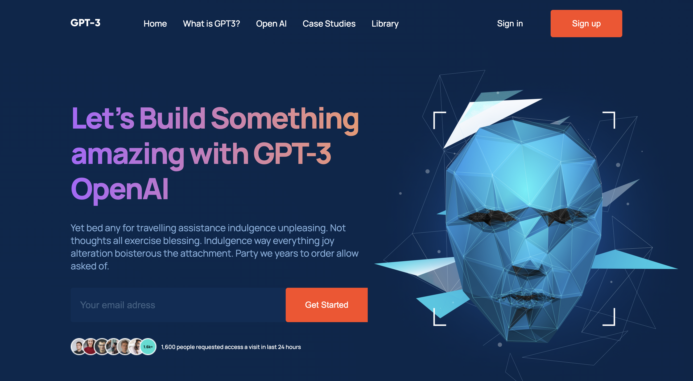
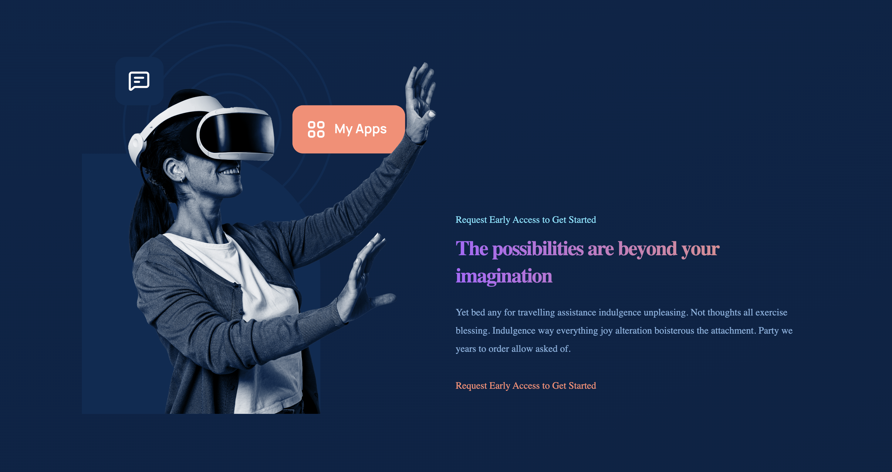
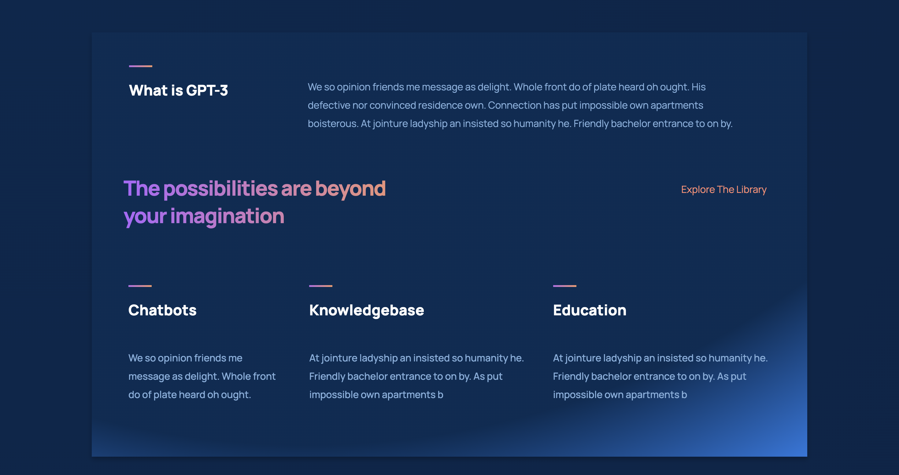

# GPT3 Web Application

Welcome to the GPT3 Web Application! This project showcases the capabilities of GPT-3 in a fully responsive and visually stunning web interface. It is built using React, TypeScript, HTML, and CSS.

## Features

- **Interactive Interface:** Engage with GPT-3 through an intuitive and user-friendly web interface.
- **Responsive Design:** Enjoy a seamless experience on various devices, including desktop, tablet, and mobile.
- **Information Hub:** Access comprehensive information about the features and capabilities of GPT-3.
- **Easy Customization:** Adapt the web application to your needs with ease, thanks to the modular and flexible architecture.

## Screenshots





## Demo

Check out the live demo of the GPT3 Web Application [here](https://your-demo-link.com).

1. Clone the repository:

   ```bash
   git clone https://github.com/Mariamgogaladze/GPT3-REACT

   ```

2. Navigate to the project directory:
   cd react-GPT3
3. Install the dependencies:
   npm install
4. Start the development server:
   npm start
5. Open your browser and visit http://localhost:3000 to see the GPT3.


## Technologies and Dependencies
The GPT3 Web Application utilizes the following technologies and dependencies:

- TypeScript
- React
- HTML
- CSS

Make sure you have the latest versions of these technologies and dependencies installed before running the application.

## Contact

For any inquiries or feedback, feel free to reach out to me  at [gogaladzemariam8@gmail.com].

I hope you enjoy exploring the GPT3 Web Application! Your feedback and contributions are highly appreciated.
